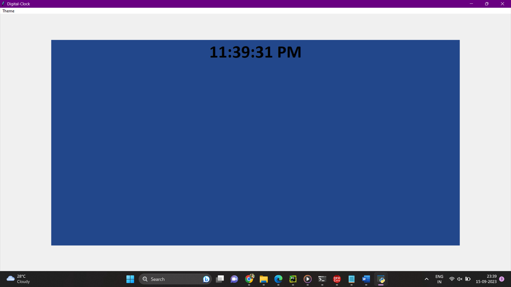

<!DOCTYPE html>
<html lang="en">
<head>
    <meta charset="UTF-8">
    <meta name="viewport" content="width=device-width, initial-scale=1.0">
    Real-Time Clock
</head>
<body>
    

        
        
Loading...

        RUN THIS FILE IN pycharm or IDLE
        
    
  
</body>
</html>
